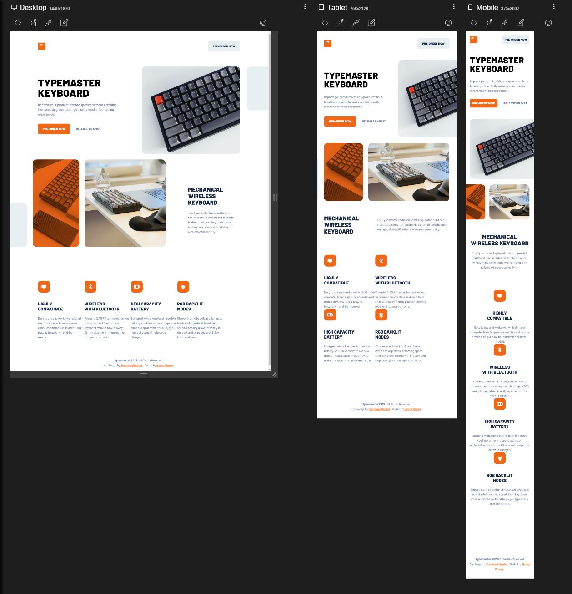

# Frontend Mentor - Typemaster pre-launch landing page solution

This is a solution to the [Typemaster pre-launch landing page challenge on Frontend Mentor](). Frontend Mentor challenges help you improve your coding skills by building realistic projects.

## Overview

### The challenge

Users should be able to:

- View the optimal layout depending on their device's screen size
- See hover states for interactive elements

### Screenshot

### Links

- [Live](https://lonelybuddy.github.io/Typemaster-pre-launch-landing-page/)
- [Solution]()

### Built with

- HTML5
- CSS3
- Sass

## Author

- Frontend Mentor - [@Henryzheng](https://www.frontendmentor.io/profile/LonelyBuddy)
